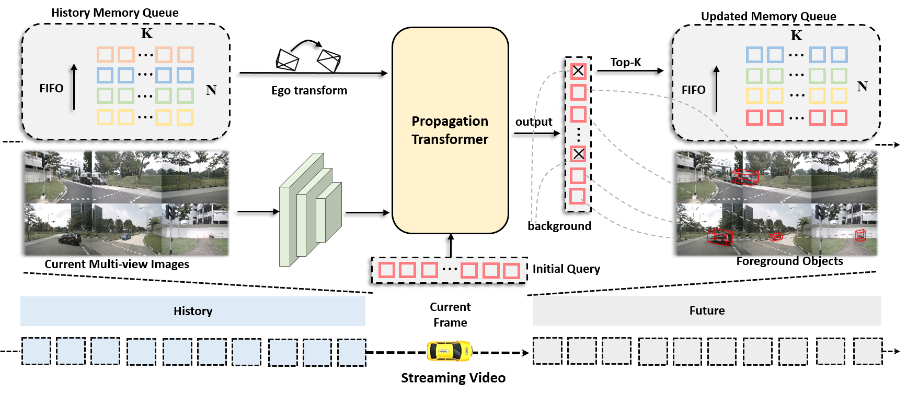
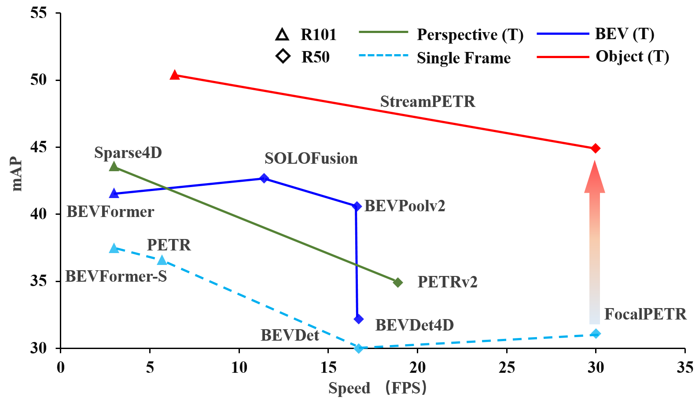

<div align="center">
<h1>StreamPETR</h1>
<h3>[ICCV2023] Exploring Object-Centric Temporal Modeling for Efficient Multi-View 3D Object Detection</h3>
</div>

[](https://paperswithcode.com/sota/3d-multi-object-tracking-on-nuscenes-camera-1?p=exploring-object-centric-temporal-modeling)
[](https://paperswithcode.com/sota/3d-object-detection-on-nuscenes-camera-only?p=exploring-object-centric-temporal-modeling)
[](https://arxiv.org/abs/2303.11926)

<div align="center">
  
</div><br/>

## Introduction

This repository is an official implementation of StreamPETR.

## News
- [2023/07/14] StreamPETR is accepted by ICCV 2023.
- [2023/05/03] StreamPETR-Large is the first online multi-view method that achieves comparable performance (62.0 mAP, 67.6 NDS and 65.3 AMOTA) with the baseline of lidar-based method. 

## Getting Started

Please follow our documentation step by step. If you like our work, please recommend it to your colleagues and friends.

1. [**Environment Setup.**](./docs/setup.md)
2. [**Data Preparation.**](./docs/data_preparation.md)
3. [**Training and Inference.**](./docs/training_inference.md)

## Model Zoo
<div align="center">
  
</div><br/>

## Results on NuScenes Val Set.
| Model | Setting |Pretrain| Lr Schd | Training Time | NDS| mAP|FPS-pytorch | Config | Download |
| :---: | :---: | :---: | :---: | :---:|:---:| :---: | :---: | :---: | :---: |
|StreamPETR| V2-99 - 900q | [FCOS3D](https://github.com/exiawsh/storage/releases/download/v1.0/fcos3d_vovnet_imgbackbone-remapped.pth) | 24ep | 13 hours | 57.1 | 48.2 | 12.5 |[config](projects/configs/StreamPETR/stream_petr_vov_flash_800_bs2_seq_24e.py) |[model](https://github.com/exiawsh/storage/releases/download/v1.0/stream_petr_vov_flash_800_bs2_seq_24e.pth)/[log](https://github.com/exiawsh/storage/releases/download/v1.0/stream_petr_vov_flash_800_bs2_seq_24e.log) |
RepDETR3D| V2-99 - 900q | [FCOS3D](https://github.com/exiawsh/storage/releases/download/v1.0/fcos3d_vovnet_imgbackbone-remapped.pth) | 24ep | 13 hours | 58.4 | 50.1 | 13.1 |[config](projects/configs/RepDETR3D/repdetr3d_vov_800_bs2_seq_24e.py) |[model](https://github.com/exiawsh/storage/releases/download/v1.0/repdetr3d_vov_800_bs2_seq_24e.pth)/[log](https://github.com/exiawsh/storage/releases/download/v1.0/repdetr3d_vov_800_bs2_seq_24e.log) |
|StreamPETR| R50 - 900q | ImageNet | 90ep | 36 hours | 53.7 | 43.2 | 26.7 |[config](projects/configs/StreamPETR/stream_petr_r50_flash_704_bs2_seq_90e.py) |[model](https://github.com/exiawsh/storage/releases/download/v1.0/stream_petr_r50_flash_704_bs2_seq_90e.pth)/[log](https://github.com/exiawsh/storage/releases/download/v1.0/stream_petr_r50_flash_704_bs2_seq_90e.log) |
|StreamPETR| R50 - 428q | [NuImg](https://download.openmmlab.com/mmdetection3d/v0.1.0_models/nuimages_semseg/cascade_mask_rcnn_r50_fpn_coco-20e_20e_nuim/cascade_mask_rcnn_r50_fpn_coco-20e_20e_nuim_20201009_124951-40963960.pth) | 60ep | 26 hours | 54.6 |44.9 | 31.7 |[config](projects/configs/StreamPETR/stream_petr_r50_flash_704_bs2_seq_428q_nui_60e.py)| [model](https://github.com/exiawsh/storage/releases/download/v1.0/stream_petr_r50_flash_704_bs2_seq_428q_nui_60e.pth)/[log](https://github.com/exiawsh/storage/releases/download/v1.0/stream_petr_r50_flash_704_bs2_seq_428q_nui_60e.log) |


The detailed results can be found in the training log. For other results on nuScenes val set, please see [Here](docs/training_inference.md).
**Notes**: 
- FPS is measured on NVIDIA RTX 3090 GPU with batch size of 1 (containing 6 view images, without using flash attention) and FP32. 
- The training time is measured with 8x 2080ti GPUs.
- RepDETR3D uses deformable attention, which is inspired by DETR3D and Sparse4D.

## Results on NuScenes Test Set.
| Model | Setting |Pretrain|NDS| mAP|AMOTA|AMOTP|
| :---: | :---: | :---: | :---: | :---:| :---: | :---:|
|StreamPETR| V2-99 - 900q | [DD3D](https://github.com/exiawsh/storage/releases/download/v1.0/dd3d_det_final.pth) | 63.6| 55.0 | - | - |
|StreamPETR| ViT-Large-900q | - | 67.6| 62.0 | 65.3| 87.6 |


## Currently Supported Features

- [x] StreamPETR code (also including PETR and Focal-PETR)
- [x] Flash attention
- [x] Deformable attention (RepDETR3D)
- [x] Checkpoints
- [x] Sliding window training
- [x] Efficient training in streaming video
- [ ] TensorRT inference
- [x] 3D object tracking

## Acknowledgements

We thank these great works and open-source codebases:

* 3D Detection. [MMDetection3d](https://github.com/open-mmlab/mmdetection3d), [DETR3D](https://github.com/WangYueFt/detr3d), [PETR](https://github.com/megvii-research/PETR), [BEVFormer](https://github.com/fundamentalvision/BEVFormer), [SOLOFusion](https://github.com/Divadi/SOLOFusion), [Sparse4D](https://github.com/linxuewu/Sparse4D).
* Multi-object tracking. [MOTR](https://github.com/megvii-research/MOTR), [PF-Track](https://github.com/TRI-ML/PF-Track).


## Citation

If you find StreamPETR is useful in your research or applications, please consider giving us a star 🌟 and citing it by the following BibTeX entry.
```bibtex
@article{wang2023exploring,
  title={Exploring Object-Centric Temporal Modeling for Efficient Multi-View 3D Object Detection},
  author={Wang, Shihao and Liu, Yingfei and Wang, Tiancai and Li, Ying and Zhang, Xiangyu},
  journal={arXiv preprint arXiv:2303.11926},
  year={2023}
}
```
